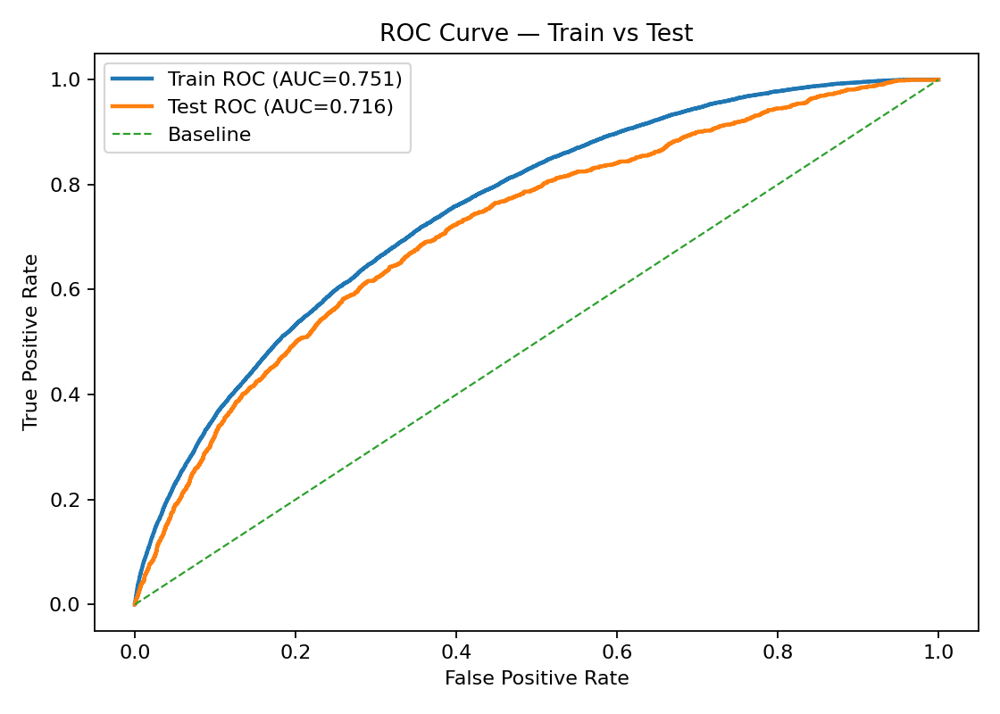
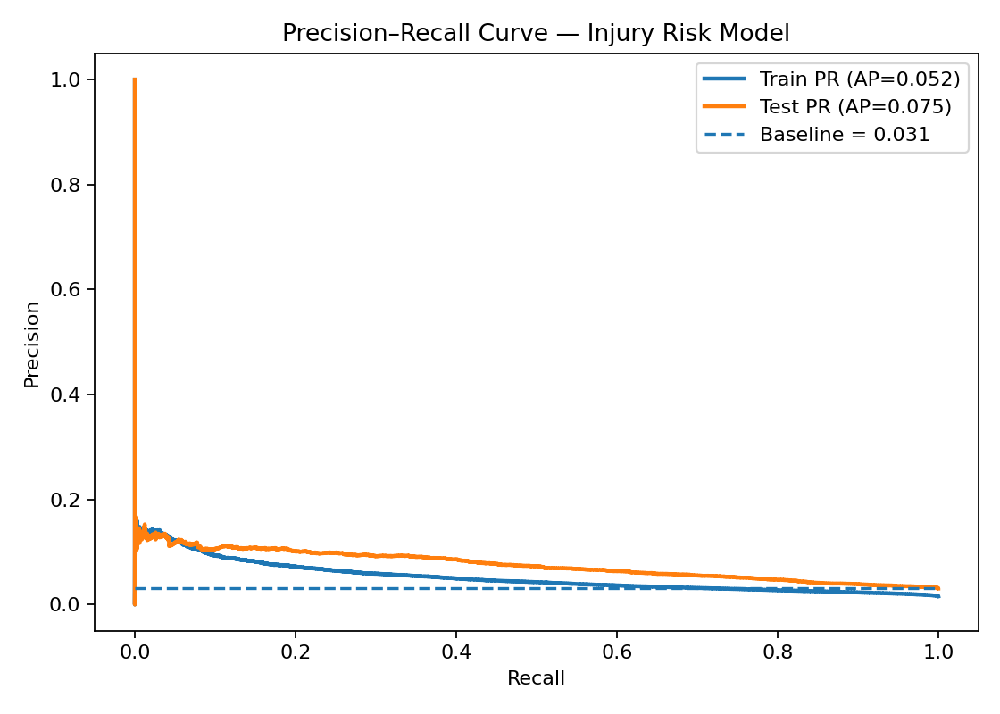
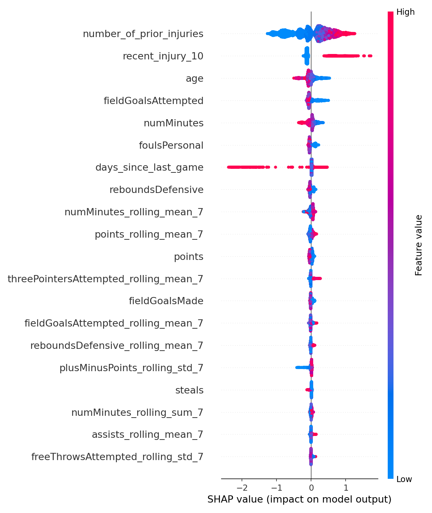

# NBA Injury Risk Forecasting (7-Day Pre-Injury Window)

Machine learning project that predicts **near-term injury risk** for NBA players using player/game history and engineered workload & schedule features. The target label is **1** for games occurring in the **7 days leading up to an injury event**.

## 🎯 Goal

- Build a reproducible injury-risk modeling pipeline.
- Engineer time-aware features (workload, rest, recent injury history).
- Train and tune a LightGBM classifier with time-series cross-validation.
- Evaluate with ROC-AUC and visualize risk trajectories for individual players.

## 🧠 Target Definition

- `injury_indicator = 1` on the injury event date (per player)
- `injury_probability = 1` for games in the **7-day window before** an injury event  
  (`[event_date - 7 days, event_date)`)

This framing supports a realistic monitoring use case: **identify elevated risk before an injury occurs**.

## 🗂 Data

All datasets used in this project are included in the repository.

Main modeling dataset:
- `data/processed/injury_analysis_preprocessed.csv`

## 🛠 Tech Stack

- Python, Pandas, NumPy
- Scikit-learn (TimeSeriesSplit, RandomizedSearchCV)
- LightGBM (classification)
- SHAP (interpretability)
- Matplotlib/Seaborn (plots)

## 📈 Results

- CV ROC-AUC: ~0.70  
- Test ROC-AUC: ~0.72  
- Dataset size: ~227k player-games  
- Positive rate: ~1.1%

The model shows stable generalization with minimal overfitting.

## 📊 Model Diagnostics

## 👥 Authors

Originally developed as a group project:

Srija Kethireddy, Mateusz Gabrys, Sujit Mandava, Karan Vohra

Refactored and documented for portfolio purposes by Mateusz Gabrys.

## Data

Raw/processed datasets are not tracked in git due to GitHub file size limits.

Data Access: The preprocessed dataset is hosted publicly at: https://drive.google.com/file/d/1XIJ1DjvMN1eKEZOZPf_qhCEBAjnNNso0/view?usp=sharing

Original datasets available from Kaggle:

NBA Injury Stats: https://www.kaggle.com/datasets/loganlauton/nba-injury-stats-1951-2023

NBA Box Scores: https://www.kaggle.com/datasets/eoinamoore/historical-nba-data-and-player-box-scores/?select=PlayerStatistics.csv

NBA Bio Data: https://www.kaggle.com/datasets/justinas/nba-players-data?select=all_seasons.csv

Place files here:
- `data/raw/`
- `data/processed/`

Expected main file:
- `data/processed/injury_analysis_preprocessed.csv`